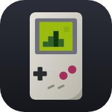
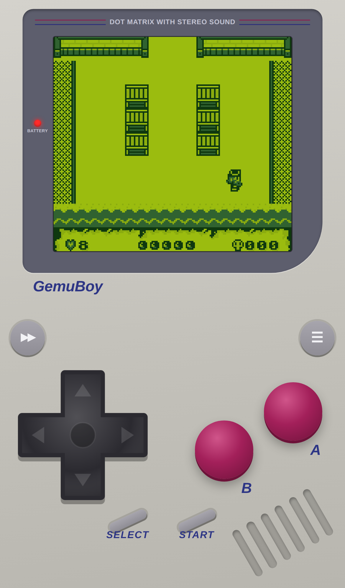
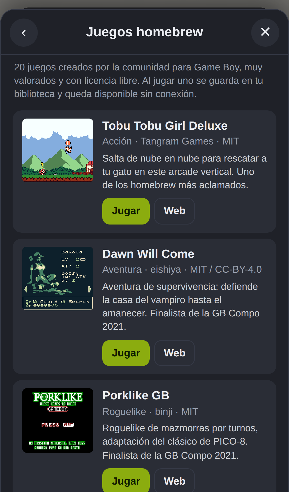
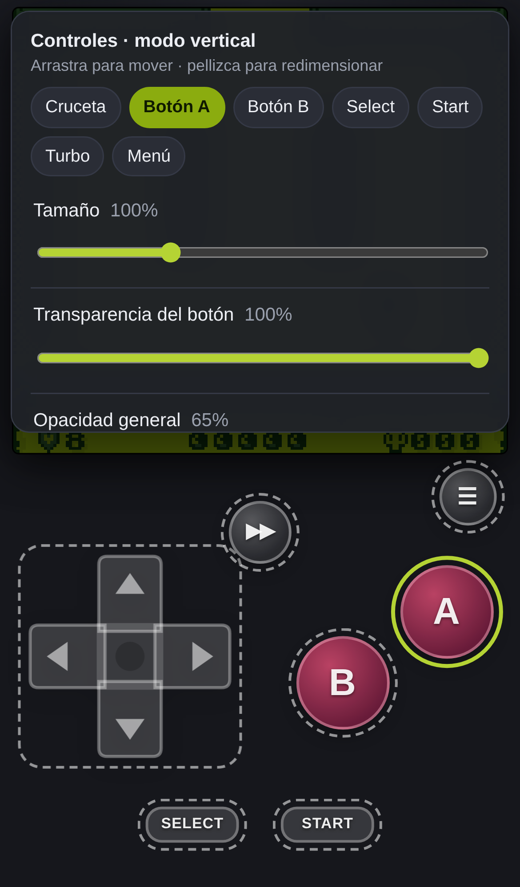
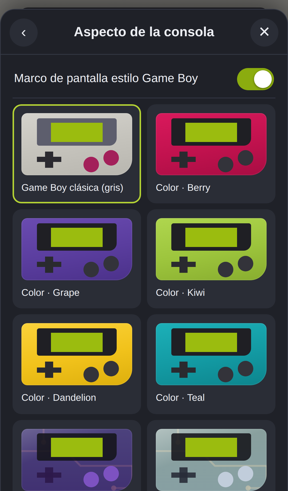
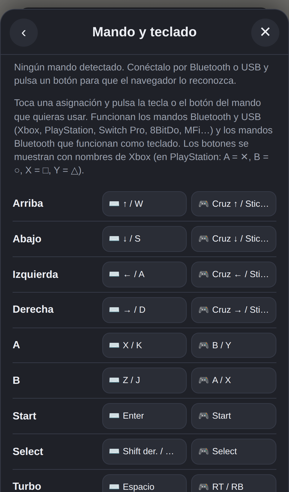
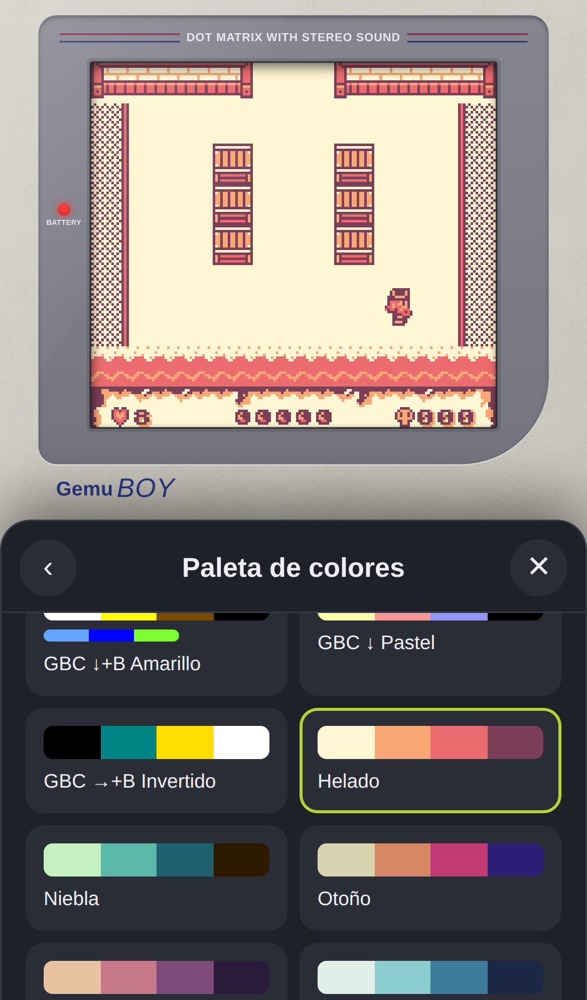
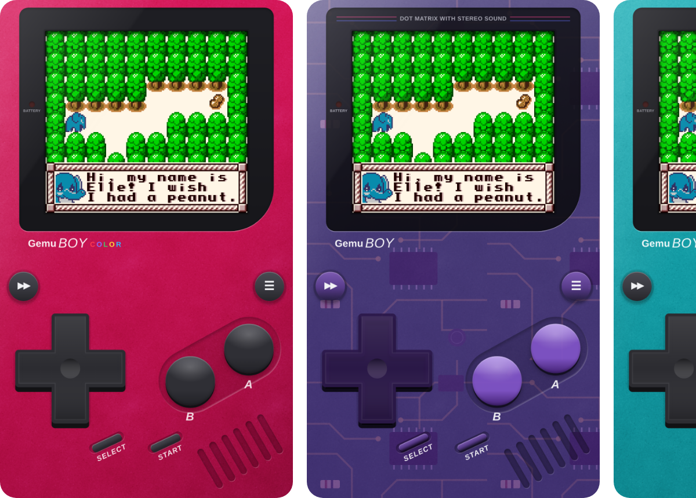
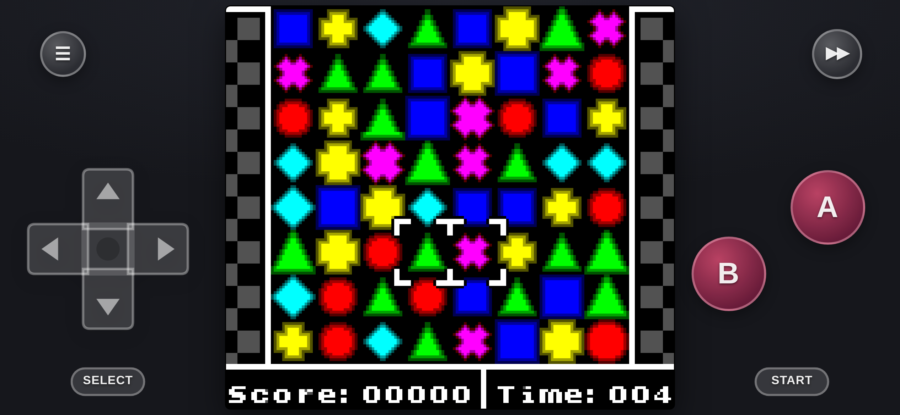

<div align="center">



# GBoy-JS

**Emulador de Game Boy y Game Boy Color para el móvil, directamente en el navegador.**
Instalable como app (PWA) · funciona sin conexión · optimizado para iPhone y Android.

## ▶️ [Jugar ahora: gabom88.github.io/gemuboy-js](https://gabom88.github.io/gemuboy-js/)

[](https://gabom88.github.io/gemuboy-js/)

<a href="https://gabom88.github.io/gemuboy-js/"></a><br>
<sub>Escanea el código con la cámara del móvil para abrirlo</sub>

</div>

---

## 📸 Capturas

<table>
  <tr>
    <td align="center"><br><sub>Jugando en vertical</sub></td>
    <td align="center"><br><sub>24 juegos homebrew gratis</sub></td>
    <td align="center"><br><sub>Editor de controles táctiles</sub></td>
  </tr>
  <tr>
    <td align="center"><br><sub>Aspectos de la consola</sub></td>
    <td align="center"><br><sub>Mando Bluetooth y teclado</sub></td>
    <td align="center"><br><sub>Paletas con vista previa</sub></td>
  </tr>
</table>

<p align="center"><br><sub>Aspectos «Berry», «Atomic Purple» (transparente) y «Teal»</sub></p>

<p align="center"><br><sub>Modo horizontal con un juego de Game Boy Color</sub></p>

## 📱 Instalar en el móvil

| iPhone / iPad (Safari) | Android (Chrome) |
| --- | --- |
| 1. Abre **[gabom88.github.io/gemuboy-js](https://gabom88.github.io/gemuboy-js/)** en Safari | 1. Abre **[gabom88.github.io/gemuboy-js](https://gabom88.github.io/gemuboy-js/)** en Chrome |
| 2. Pulsa **Compartir** ⎋ | 2. Pulsa **Instalar** (o menú ⋮ → **Instalar aplicación**) |
| 3. Elige **«Añadir a pantalla de inicio»** | 3. Abre GBoy-JS desde el icono |

Ya instalada se abre a pantalla completa, como una app nativa, y funciona sin conexión. También
puedes usarla directamente en el navegador sin instalar nada.

**Para empezar a jugar:** abre **Juegos** y elige **🆓 Juegos homebrew gratuitos**, o **📂 Cargar ROM**
para abrir tus propios archivos `.gb`, `.gbc` o `.zip`.

## ✨ Funciones

- 📱 **PWA instalable**: pantalla completa, icono propio y funciona sin conexión.
- 🕹️ **Aspecto de Game Boy clásica**: cuerpo gris de la Game Boy original (DMG), marco de pantalla
  con las franjas y el piloto de encendido, cruceta negra, botones A/B granate y Start/Select inclinados.
- 🖌️ **Aspectos (skins) intercambiables**: Game Boy gris (por defecto), colores de la Game Boy Color
  (Berry, Grape, Kiwi, Dandelion, Teal), carcasas **transparentes** que dejan ver la placa
  (Atomic Purple, Cristal, Verde jungla, Humo) y un tema oscuro. El marco de pantalla se puede desactivar.
- 🎮 **Gamepad táctil multitáctil**: cruceta de 8 direcciones, A, B, Start, Select, Turbo y Menú.
  - **Editor de controles**: mueve cada botón arrastrándolo y cambia su **tamaño** (con el deslizador
    o pellizcando) y su **transparencia**. Hay opacidad general y puedes mostrar u ocultar botones.
    Los diseños vertical y horizontal se guardan por separado.
  - Vibración al pulsar (Android; háptica en iOS 18+).
- 🎨 **Paletas de color** para juegos de Game Boy original: 18 predefinidas (verde DMG, Pocket, Light,
  paletas de arranque de la Game Boy Color…) y una **personalizada**. Vista previa en vivo.
- 💾 **Guardado en tiempo real**:
  - La partida del cartucho (y el reloj de juegos como Pokémon Oro/Plata) se guarda automáticamente
    en cuanto cambia y al salir de la app.
  - **Autoguardado de estado**: al reabrir la app continúas exactamente donde lo dejaste
    (importante en iPhone, que cierra las apps web en segundo plano).
  - 4 ranuras de **estados guardados** con miniatura.
  - Exportar e importar partidas `.sav`.
- 🗄️ **localStorage**: se guardan tus ajustes y los **ROMs** (comprimidos). Si un ROM no cabe, se
  guarda automáticamente en IndexedDB.
- 🆓 **24 juegos homebrew gratuitos** muy valorados (Tobu Tobu Girl Deluxe, µCity, Porklike GB,
  Dawn Will Come, Shock Lobster, Super JetPak DX, Deadeus, DMG Deals Damage…), la mayoría con
  licencias libres. Al jugar uno se guarda en tu biblioteca y
  funciona sin conexión. Créditos y licencias en [`static/homebrew/LICENSES.md`](static/homebrew/LICENSES.md).
- 📚 Biblioteca de ROMs guardados; carga de `.gb`, `.gbc` y `.zip`.
- 🎮 **Mandos Bluetooth/USB y teclado configurables**: asigna cada botón (A, B, Start, Select, cruceta,
  turbo, menú y guardar/cargar estado) a la tecla o al botón del mando que quieras. Funciona con mandos
  Xbox, PlayStation, Switch Pro, 8BitDo, MFi y con mandos Bluetooth en modo teclado.
- ⏩ Turbo (2×–8×, mantener pulsado o activar/desactivar).
- 🖥️ Escalado ajustado o entero (píxeles perfectos), efecto LCD, suavizado y contador de FPS.
- 🗂️ **Menú en tarjetas**: Continuar, Reiniciar, Juegos, Guardar / Cargar, Interfaz, Controles, Ajustes e
  Instalar y ayuda; cada sección se abre como lista.
- 🌗 **6 temas de color para el menú** (3 oscuros y 3 claros): se cambian con el botón de sol/luna junto a
  la ✕.
- 🖥️ **Ajuste de pantalla automático o manual**: en automático y sin marco la pantalla usa todo el ancho; en
  manual puedes arrastrarla y cambiar su tamaño con un deslizador o pellizcando (Controles → Ajustar pantalla).
- 📤 **Exportar e importar los ajustes** como `GBoy-JS_Settings_[fecha] [hora].json` (Ajustes → Copia de
  seguridad de ajustes).
- ⚙️ **Dos motores de emulación** (Menú → Ajustes → Motor de emulación):
  - **SameBoy** (principal): emulador de alta precisión compilado a WebAssembly. Mejor sonido,
    compatibilidad y temporización; incluye reloj de tiempo real y vibración de cartuchos con rumble.
  - **gemuboi.js** (secundario): el motor ligero en JavaScript puro. Se usa automáticamente si
    SameBoy no se puede cargar.
  - La partida del cartucho (`.sav`) se comparte entre ambos motores; los estados guardados son
    propios de cada motor.

## ⌨️ Teclado y mando

Todas las asignaciones se pueden cambiar en **Menú → Controles → Mando Bluetooth y teclado**. Valores por defecto:

| Botón | Tecla |
| --- | --- |
| Cruceta | Flechas / WASD |
| A | X / K |
| B | Z / J |
| Start | Enter |
| Select | Shift / Retroceso |
| Turbo | Espacio (mantener) |
| Menú | Esc |
| Guardar / cargar estado 1 | F2 / F4 |

Con mando: A/B del mando = B/A de la Game Boy (posición Nintendo), cruceta o stick izquierdo, Start,
Select, gatillo derecho = turbo, LB/LT = guardar/cargar estado. **Start + Select** abre el menú.

> **Conectar un mando Bluetooth:** emparéjalo en los ajustes de Bluetooth del teléfono, abre GBoy-JS
> y pulsa cualquier botón del mando para que el navegador lo detecte.

## 🛠️ Para desarrolladores

**Desarrollo local**

```sh
npx http-server -c-1 .
# abre http://localhost:8080
```

**Motor SameBoy (WebAssembly):** el resultado compilado ya está en `js/sameboy/`. Para
recompilarlo hace falta [Emscripten](https://emscripten.org/) (`emcc`) y Python 3:

```sh
./wasm/build.sh      # descarga SameBoy en el commit de wasm/SAMEBOY_COMMIT y genera js/sameboy/
```

La interfaz en C está en [`wasm/sameboy_glue.c`](wasm/sameboy_glue.c) y los boot ROMs de código
abierto de SameBoy en [`wasm/bootroms/`](wasm/bootroms/).

**Publicación:** el workflow [`.github/workflows/pages.yml`](.github/workflows/pages.yml) publica la
app en GitHub Pages en cada push a `master`. Requiere activar una sola vez
**Settings → Pages → Build and deployment → Source: GitHub Actions**.

---

Motores: [SameBoy](https://github.com/LIJI32/SameBoy) de Lior Halphon (licencia Expat,
ver [`js/sameboy/LICENSE`](js/sameboy/LICENSE)) y [gemuboi.js](https://github.com/danwsong/gemuboi-js)
de Daniel Song. Usa solo copias de juegos que poseas legalmente.

<p align="center"><a href="https://www.buymeacoffee.com/bardock" target="_blank"></a></p>
